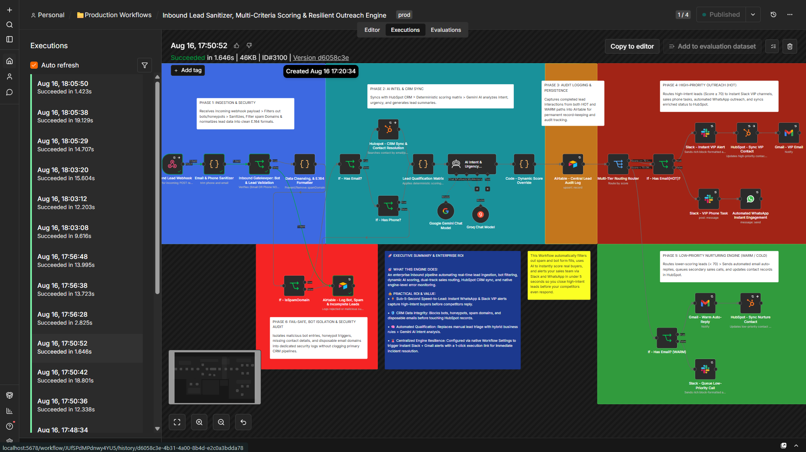
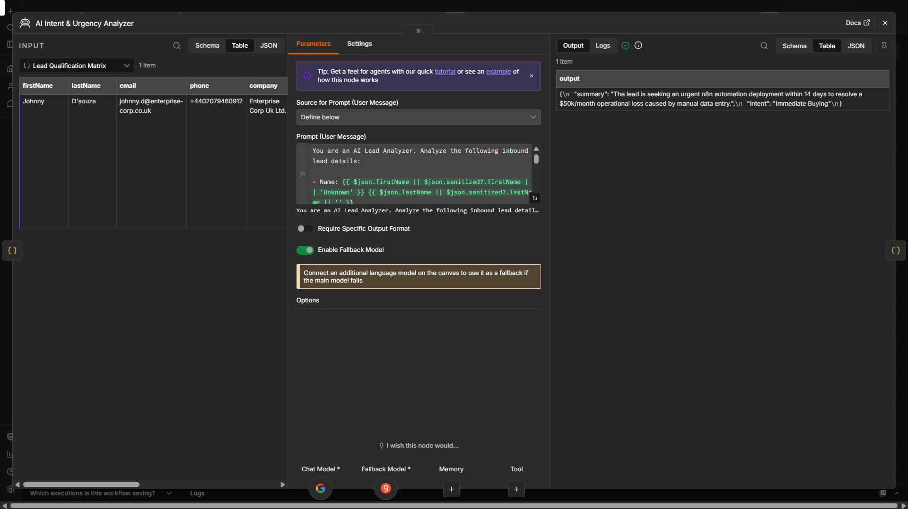
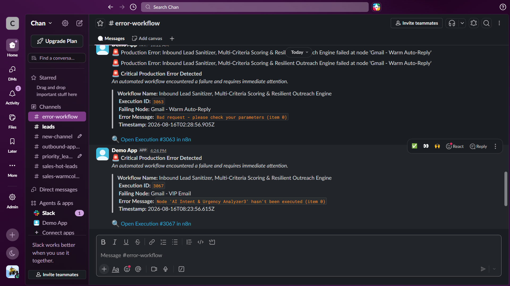
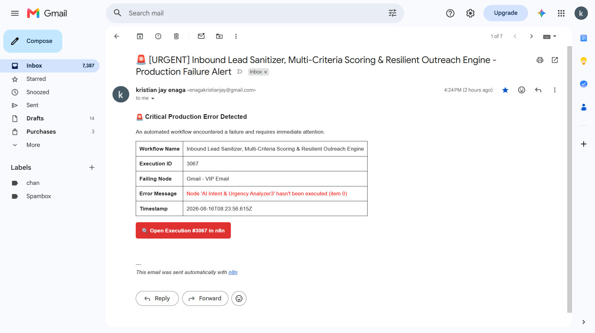

# ⚡ Enterprise Inbound Lead Sanitizer & Resilient Outreach Engine

Production-grade n8n pipeline that turns raw form submissions into clean, AI-scored, instantly routed leads—so sales teams respond to hot prospects in seconds instead of hours.

- Sub-5-second speed-to-lead with automated Slack/WhatsApp/Gmail routing
- Filters bots, spam, and invalid phones/emails before they hit HubSpot
- Hybrid AI + rules-based scoring with full audit logs and error resilience

**Stack:** n8n + HubSpot + Gemini/Groq + Slack/WhatsApp/Gmail + Airtable

---
An enterprise-grade n8n inbound pipeline built for sub-5-second speed-to-lead execution, defensive data cleansing, hybrid AI qualification, and automated multi-channel routing.

---

🎬 **Video Demo:** Watch the full architecture, defensive data cleansing, and resilient fail-safe walkthrough on [Loom](https://www.loom.com/share/c38d37d65eed44129a712e530a8e2446).

---

## 🎯 Business Problem

Sales and marketing teams lose up to **30% of high-intent leads** due to delayed follow-ups and bloated CRM databases. Form spam, bot submissions, disposable email domains, and malformed phone numbers routinely contaminate CRMs like HubSpot, forcing sales reps to waste hours manually verifying incoming prospects instead of closing deals.

---

## 🚀 Solution Overview

This production-grade n8n engine acts as a resilient gatekeeper and speed-to-lead routing engine:

1. **Ingestion & Security Gatekeeper:** Silently drops bots and honeypots, sanitizes inputs, enforces international E.164 phone formatting, and checks disposable spam domain blocklists.
2. **AI Intel & CRM Sync:** Upserts verified contacts into HubSpot and uses Google Gemini AI (with Groq fallback) to analyze lead intent, assign urgency levels (`Exploring`, `Immediate Buying`, `Support`, or `Spam`), and generate executive summaries.
3. **Multi-Tier Score Routing:**
   * **Hot Leads (Score ≥ 70):** Triggers instant `#sales-hot-leads` Slack VIP alerts, schedules phone tasks, and fires automated WhatsApp outreach.
   * **Warm Leads (Score < 70):** Dispatches personalized Gmail auto-replies and tags contacts for HubSpot nurture sequences.
4. **Audit Trail & Fail-Safe Security:** Writes execution metrics to Airtable central audit logs while completely isolating bot entries away from primary sales pipelines.
5. **Global Incident Resilience:** Captures unhandled workflow exceptions and automatically dispatches rich Slack and Gmail alerts equipped with 1-click execution recovery links for immediate incident triage.

---

## 💰 Business Impact & ROI

* **⚡ Sub-5-Second Speed-to-Lead:** Instantly alerts sales reps via Slack and initiates automated WhatsApp messages to engage hot leads before competitors respond.
* **🛡️ Defensive CRM Hygiene:** Filters out honeypots, invalid phone numbers, and disposable emails before touching HubSpot records.
* **🧠 Hybrid Qualification:** Replaces manual triage with deterministic business rules (budget/company size) + Gemini AI intent scoring.
* **🚨 Enterprise Incident Resilience:** Engine-level Error Trigger captures API downtime, rate limits, and payload shifts—instantly notifying engineering via Slack & Gmail with a direct 1-click execution recovery URL while maintaining complete Airtable audit persistence to guarantee zero data loss.

---

## 🧪 Live Execution Proof & Payload Verification

Here is the verified execution log confirming successful end-to-end data processing, AI scoring, and multi-channel delivery.

### 1. Successful n8n Execution History

*Figure 1: n8n execution history showing 100% successful runs across all 6 architectural phases.*

### 2. Node Input / Output JSON Data Payload & AI Prompt Analysis

*Figure 2: Structured JSON payload displaying cleansed E.164 phone data, Gemini AI intent analysis, and lead scoring outputs.*

### 3. Engine Resilience & Incident Alerts
| Slack Incident Alert | Gmail Recovery Alert |
| :--- | :--- |
|  |  |

*Figure 3: Automatic incident alerts containing direct 1-click execution links for instant debugging.*

---

## 🧩 Node-by-Node Breakdown

* **1. Webhook Trigger (Lead Ingestion):**
  * **What it does:** Captures raw inbound lead payloads (names, phone numbers, emails, budgets, and message details) instantly from web forms or landing pages.
  * **Value:** Ensures sub-5-second ingestion speed with zero dropped form submissions during traffic spikes.

* **2. Honeypot & Bot Filter (Security Gatekeeper):**
  * **What it does:** Inspects silent form fields (honeypots) and submission timestamps to identify and drop spam bots.
  * **Value:** Protects downstream databases and CRM contact limits from automated spam contamination.

* **3. Phone Sanitizer & E.164 Normalizer (Data Cleansing):**
  - *What it does:* Trims raw string inputs, corrects common email domain typos (e.g., converting `:com` or `,com` to `.com`), strips non-numeric characters from incoming phone numbers, and formats them to international E.164 standards (`+1`, `+63`, etc.).
  - *Value:* Eliminates malformed inputs, prevents email soft bounces, and guarantees valid phone formatting required for automated SMS/WhatsApp routing and CRM synchronization.

* **4. Spam Domain & Disposable Email Check (Verification Gate):**
  * **What it does:** Validates lead email addresses against blocklists of disposable/temporary email providers.
  * **Value:** Prevents fake leads from wasting sales team outreach time and protects domain email deliverability ratings.

* **5. HubSpot CRM Search & Upsert (Contact Sync):**
  * **What it does:** Checks if the lead already exists in HubSpot; creates a new contact or updates existing records without creating duplicates.
  * **Value:** Maintains clean, deduplicated CRM data without requiring manual data entry.

* **6. Gemini AI Intent Scoring & Groq Fallback (AI Qualification):**
  * **What it does:** Evaluates lead message content, assigns an intent score (0–100), categorizes buying urgency, and generates an executive summary. Uses Groq as an instant fallback if Gemini limits are reached.
  * **Value:** Replaces manual lead triage with deterministic AI qualification, prioritizing high-value buyers instantly.

* **7. Multi-Tier Score Router (Dynamic Sales Dispatch):**
  * **What it does:** Directs leads down dedicated channels based on their qualification score:
    * **`Hot Leads (Score ≥ 70)`:** Dispatches instant Slack VIP alerts, schedules call tasks, and triggers WhatsApp outreach.
    * **`Warm Leads (Score < 70)`:** Fires personalized Gmail auto-replies and tags contacts for email nurture campaigns.
  * **Value:** Maximizes speed-to-lead for top prospects while automating routine follow-ups for mid-tier leads.

* **8. Airtable Audit Log (Database Persistence):**
  * **What it does:** Records full execution logs, AI scores, phone status, and timestamps into an audit database.
  * **Value:** Delivers an immutable audit trail for sales analytics, reporting, and workflow debugging.

* **9. Engine Error Trigger & Incident Handler (Resilience Layer):**
  * **What it does:** Captures unhandled workflow errors, API rate limits, or network timeouts, instantly alerting engineering via Slack and Gmail with a 1-click execution recovery link.
  * **Value:** Guarantees zero data loss and enables 1-click incident recovery without digging through server logs.
---

## 🛠️ Tech Stack & Integrations

* **Automation Engine:** n8n (Self-Hosted / Production)
* **CRM Layer:** HubSpot API (Private App Access Token)
* **AI Intelligence:** Google Gemini API & Groq Fallback Model (Structured Outputs)
* **Communication Channels:** Slack API, WhatsApp Business API, Gmail API
* **Database & Audit Logs:** Airtable API

---

## ⚙️ How to Import

1. Download the `Inbound Lead Sanitizer, Multi-Criteria Scoring & Resilient Outreach Engine.json` file from this repository.
2. Open your n8n canvas → **Workflows** → **Import from File**.
3. Reconnect your credentials for **HubSpot**, **Gemini**, **Groq**, **Slack**, **WhatsApp**, **Gmail**, and **Airtable**.
4. Set workflow status to **Active** and link your production webhook URL to your lead capture forms.

---

## 📈 Engineering Roadmap & Milestone

* **Roadmap Phase:** Phase 2 (Automation Engineering)
* **Sprint Tracker:** Sprint 3 — JSON Data Engineering & Portfolio Documentation
* **Build Milestone:** Completed (Day 60/153)
