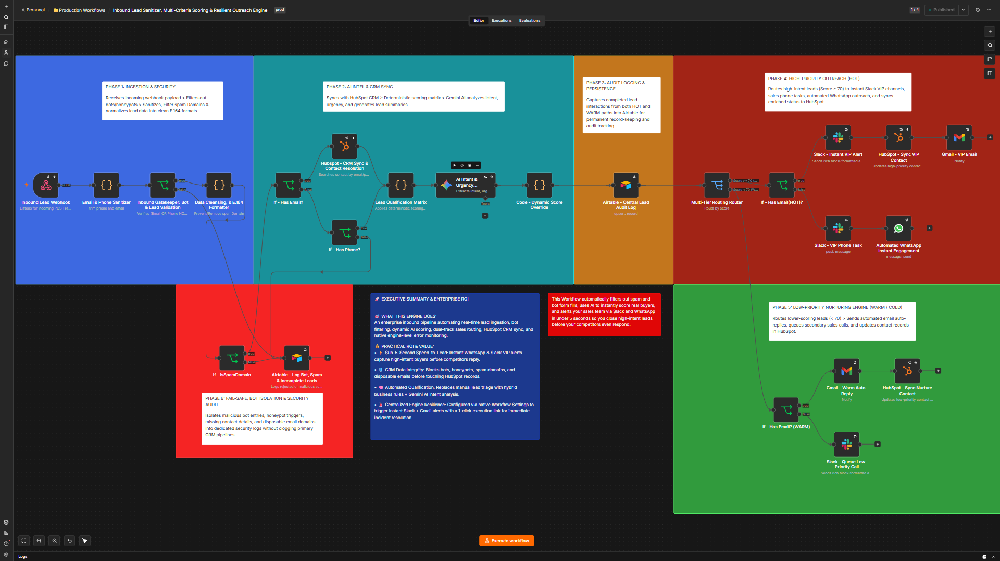

# ⚡ Enterprise Inbound Lead Sanitizer & Resilient Outreach Engine

An enterprise-grade n8n inbound pipeline built for sub-5-second speed-to-lead execution, defensive data cleansing, hybrid AI qualification, and automated multi-channel routing.

🎬 **Video Demo:** Watch the full architecture, defensive data cleansing, and resilient fail-safe walkthrough on [Loom](YOUR_LOOM_LINK_HERE).

---

## 🎯 Business Problem
Sales and marketing teams lose up to **30% of high-intent leads** due to delayed follow-ups and bloated CRM databases. Form spam, bot submissions, disposable email domains, and malformed phone numbers routinely contaminate CRMs like HubSpot, forcing sales reps to waste hours manually verifying incoming prospects instead of closing deals.

---

## 🚀 Solution Overview
This production-grade n8n engine acts as a resilient gatekeeper and speed-to-lead routing engine:

1. **Ingestion & Security Gatekeeper:** Silently drops bots and honeypots, sanitizes inputs, enforces international E.164 phone formatting, and checks disposable spam domain blocklists.
2. **AI Intel & CRM Sync:** Upserts verified contacts into HubSpot and uses Google Gemini AI to analyze lead intent, assign urgency levels (`Exploring', 'Immediate Buying', 'Support', or 'Spam`), and generate executive summaries.
3. **Multi-Tier Score Routing:**
   * **Hot Leads ($\text{Score} \ge 70$):** Triggers instant `#sales-hot-leads` Slack VIP alerts, schedules phone tasks, and fires automated WhatsApp outreach.
   * **Warm Leads ($\text{Score} < 70$):** Dispatches personalized Gmail auto-replies and tags contacts for HubSpot nurture sequences.
4. **Audit Trail & Fail-Safe Security:** Writes execution metrics to Airtable central audit logs while completely isolating bot entries away from primary sales pipelines.

---

## 💰 Business Impact & ROI
* **⚡ Sub-5-Second Speed-to-Lead:** Instantly alerts sales reps via Slack and initiates automated WhatsApp messages to engage hot leads before competitors respond.
* **🛡️ Defensive CRM Hygiene:** Filters out honeypots, invalid phone numbers, and disposable emails before touching HubSpot records.
* **🧠 Hybrid Qualification:** Replaces manual triage with deterministic business rules (budget/company size) + Gemini AI intent scoring.
* **🚨 Production Resilience:** Centralized engine-level monitoring and Airtable audit logs ensure zero data loss during API downtime or network timeouts.

---

## 🧪 Live Execution Proof & Payload Verification

Here is the verified execution log confirming successful end-to-end data processing, AI scoring, and multi-channel delivery.

### 1. Successful n8n Execution History

*Figure 1: n8n execution history showing 100% successful runs across all 6 architectural phases.*

### 2. Node Input / Output JSON Data Payload

*Figure 2: Structured JSON payload displaying cleansed E.164 phone data, Gemini AI intent analysis, and lead scoring outputs.*

---

## 🛠️ Tech Stack & Integrations
* **Automation Engine:** n8n (Self-Hosted / Production)
* **CRM Layer:** HubSpot API (Private App Access Token)
* **AI Intelligence:** Google Gemini API (Structured Outputs)
* **Communication Channels:** Slack API, WhatsApp Business API, Gmail API
* **Database & Audit Logs:** Airtable API

---

## ⚙️ How to Import

1. Download the `Inbound Lead Sanitizer, Multi-Criteria Scoring & Resilient Outreach Engine.json` file from this repository.
2. Open your n8n canvas $\rightarrow$ **Workflows** $\rightarrow$ **Import from File**.
3. Reconnect your credentials for **HubSpot**, **Gemini**, **Slack**, **WhatsApp**, **Gmail**, and **Airtable**.
4. Set workflow status to **Active** and link your production webhook URL to your lead capture forms.

---

## 📈 Engineering Roadmap & Milestone
* **Roadmap Phase:** Phase 2 (Automation Engineering)
* **Sprint Tracker:** Sprint 3 — JSON Data Engineering & Portfolio Documentation
* **Build Milestone:** Completed (Day 59/153)
